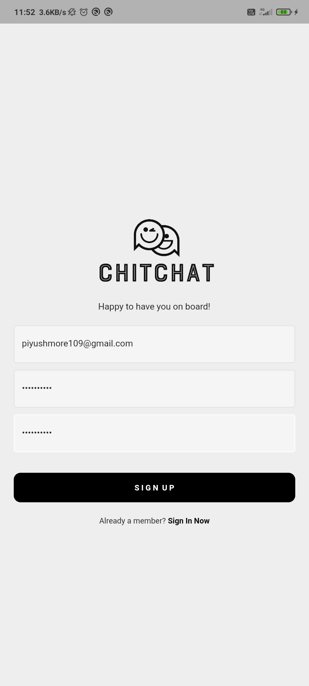
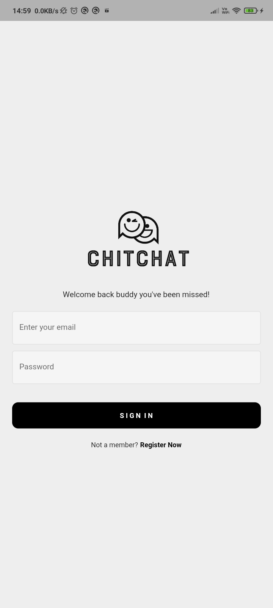
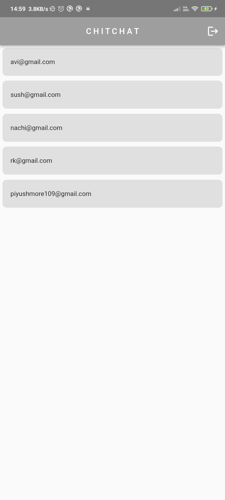
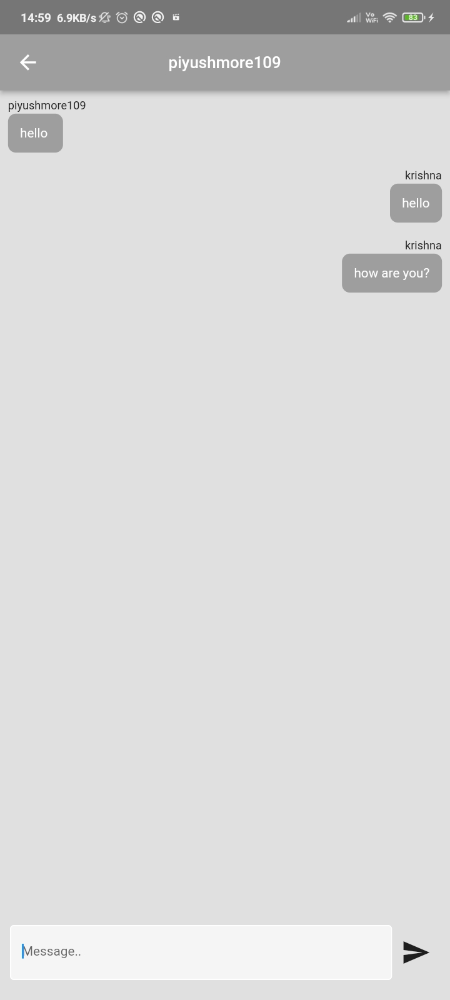

# ChitChat App

ChitChat is a Flutter-based chat application developed as a personal project. It allows users to register and sign up using their email and password, enabling seamless communication with friends, family, and colleagues. Powered by Firebase's Firestore, ChitChat offers real-time messaging capabilities and a user-friendly interface.

## Key Features

- User Registration and Sign Up: Users can create personalized accounts using their email and password, ensuring secure access to the application.
- Real-Time Messaging: Engage in dynamic conversations with friends and loved ones, enjoying instant message delivery and receipt.
- User-Friendly Interface: ChitChat offers a sleek and intuitive design, making chatting a delightful experience.

## Screen Shot
                                                                                                                                                                                                                                                            

## Technologies Used

- Flutter: A powerful UI toolkit for building beautiful and natively compiled applications for mobile, web, and desktop from a single codebase.
- Firebase Firestore: A flexible, scalable, and real-time NoSQL cloud database provided by Firebase.

## Getting Started

To run ChitChat locally, follow these steps:

1. Clone the repository: `git clone https://github.com/your-username/chitchat-app.git`
2. Navigate to the project directory: `cd chitchat-app`
3. Ensure you have Flutter installed. For installation instructions, refer to the official Flutter documentation: [Flutter Installation Guide](https://flutter.dev/docs/get-started/install)
4. Run `flutter pub get` to install the project dependencies.
5. Connect the app to your Firebase project. Create a new Firebase project and follow the Firebase setup instructions to obtain the necessary configuration files (google-services.json). Place the configuration files in the appropriate location within the Flutter project.
6. Launch the app using `flutter run`.
